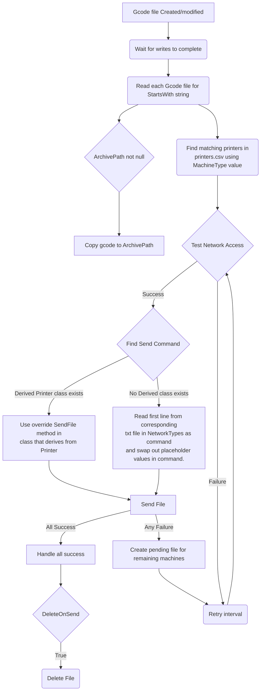

https://github.com/user-attachments/assets/c45f5d5d-7efd-45b0-9572-a24f6d81eddc

# Print File Manager
Print File Manager (PFM) is a console application to solve the problem I had with managing gcode files across my farm of various 3d printers. Since printers are not always online, they don't always get every file that I may slice for a specific machine. For instance I may slice one of my shop's prints for my Elegoo Centauri Carbon and I would then manually upload it to 2 of the machines that needed to print it now. The other 3 ECC's would never get that file because they would not be turned on at the time of slicer.

This is where PFM comes into play. You slice to file into a "Watch Directory" and PFM will automatically attempt to contact every machine that the gcode file is sliced for. It the machine is online, it will send the file. If it is offline, it holds the file locally and tries again every so often until the machine is online. Once it is online, the file sends - keeping all machines up to date with all my shops gcode. 

# Running PFM
PFM can be used in 2 different ways. A console application that you can start and stop as needed. If there are any pending files to be sent when you close PFM, they will be stored for the next time to you start PFM and it will do its thing.

PFM can also be used as a Windows service, which is done with NSSM. There is an install and remove powershell script included for easy setup and removal of the service.

# Configuration / Setup

 1. Download from Releases.
 2. Open **config.ini** and configure as needed. See [config.ini](#config.ini) for specifics.
 3. Open **printers.csv** and add printers as needed. See [Printers.csv](#printers.csv) for specifics.
 4. Edit machine starting code to include a **MachineType** search string. Default of **;Sliced for**. In Orca Slicer you can use placeholders to make this very easy. Ex: **;Sliced for {printer_preset}** in the Machine Start G-Code will auto populate this for you.
	 *Note: The string that Orcra uses for {printer_preset} must match your MachineType in the CSV. For instance have a Printer profile named "Ender3"*
  

 5. (Optional) Create custom **NetworkTypes** for machines that have special requirements. See [NetworkTypes](#NetworkTypes) for more info.

## Config.ini
Example File:

    [App]
    WatchPath=c:\slicedFiles
    MachineType=;Sliced for
    ArchivePath=E:\archive\Sliced Files
    DeleteOnSend=true
    RecheckInterval=30
    LogPath=
    LogFileEnabled=true 

**WatchPath** is the directory to watch for new gcode files. A full path is recommended.
**MachineType** is what PFM looks for inside gcode files to determine what machines to send the file to
**ArchivePath** if not null, copies gcode files to this path when starts processing a batch.
**DeleteOnSend** if true, deletes gcode files when successfully sends to all target machines.
**RecheckInterval** how often to retry offline/failed machines.
**LogPath** if null, log.txt is created next to the exe. Otherwise at the full path specified.
**LogFileEnabled** if true, writes messages to the log.txt file. If false, only logs to stdout - if running as service you won't get any output.

## Printers.csv
Printers.csv uses the following format to store printers. This file is ONLY consumed when the application starts. For changes to be read, you must restart the service/application.

Fields may be left blank if not needed, such as API key for a Moonraker printer. Please read and understand [NetworkTypes](#NetworkTypes) for how to pick this value.
|MachineType|NetworkAddress|ApiKey|NetworkType|
|--|--|--|--|
|Ender3|e3.domain.local|12345abc|octoprint|
|Ender3|e3-A.domain.local|12345abc|octoprint|
|Ender3_06Nozzle|e3-B.domain.local|12345abc|octoprint|
|CentauriCarbon|occ.domain.local||openCentauriCarbon|
|SovolZero|192.168.1.100||moonraker|
|SovolZero|192.168.1.101||moonraker|

## NetworkTypes
Each printer needs a network type so PFM knows how to actually send the file to the printer. All printers have different requirements to send files over the network. PFM is extensible to allow for some customization in this area.

If a **NetworkType** inside the printers.csv file matches the name of a class that derives from **Printer.cs**, custom code can be used to send a file to that matching machine type. For instance the Elegoo Centauri Carbo running Open Centauri requires files be chunked and sent. You can reference **printers/openCentauriCarbon.cs** for an example.

If there are no derived class matches, a generic 1 liner command will be used inside the **NetworkTypes** folder. For instance a machine using the NetworkType of **octoprint** will look inside the **octoprint.txt** file for the command to use. Only the first line of the .txt file is used.

Before executing the command in the .txt file, placeholder strings are replaced with corresponding printer information.
|Placeholder String| Resulting Value |Example|
|--|--|--|
|[ApiKey]|Printer's API key from printers.csv|ABC12345XYZ|
|[NetworkType]|Printer's NetworkType string|octoprint|
|[NetworkAddress]|Printer's Network Address string|printer.domain.local|
|[FilePath]|Absolute file path for the GCode file to send|c:\slicedFiles\object.gcode|

## Flow

 1. File(s) are created or changed in the **WatchPath** specified in the config.ini file and waits for writes to finish. *Editing a file in the directory will retrigger the entire flow and cause a re-upload to all target machines.*
 2. PFM gathers all GCode files that triggered a change or created - multiple files are consumed as 1 "Batch"
 3. For each GCode file, PFM reads the file and files a line that **StartsWith** the **MachineType** string from the **config.ini** file, once found it takes whatever follows and finds all matching printers from **Printers.csv**. 
 4. PFM tests network connectivity using a basic ping to the target printers.
 5. If successful, Sends the gcode to the target printer using the command stored in the corresponding file inside the **NetworkTypes** folder.
 6. If unsuccessful, creates a pending file and will try again later.
 7. When eventually successful, sends the file to the target machine once it comes online.

### Example
Based on the example printers.csv file below. A gcode file is saved from OrcaSlicer that contains **;Sliced for Ender3** into the **WatchPath** directory.

PFM Reads that file and finds the **MachineType** string and reads **Ender3** from that file. There are 2 machines that match the MachineType. PFM selects the machines at e3.domain.local and e3-A.domain.local as targets. A network test will be send to each of those addresses for success. Lets say e3 is online, and e3-A is offline.

PFM will use the **octoprint.txt** file inside the **NetworkTypes** folder as the command to send to Octoprint. Placeholder values are replaced from the txt file for each printer to use its settings, like API key and network address. The file will be sent to e3.domain.local.

Since e3-a was offline, a .pend file will be created in the **PendingFiles** directory. This indicated that e3-a could not be reached or failed to send. It will try again next **RecheckInterval**.

